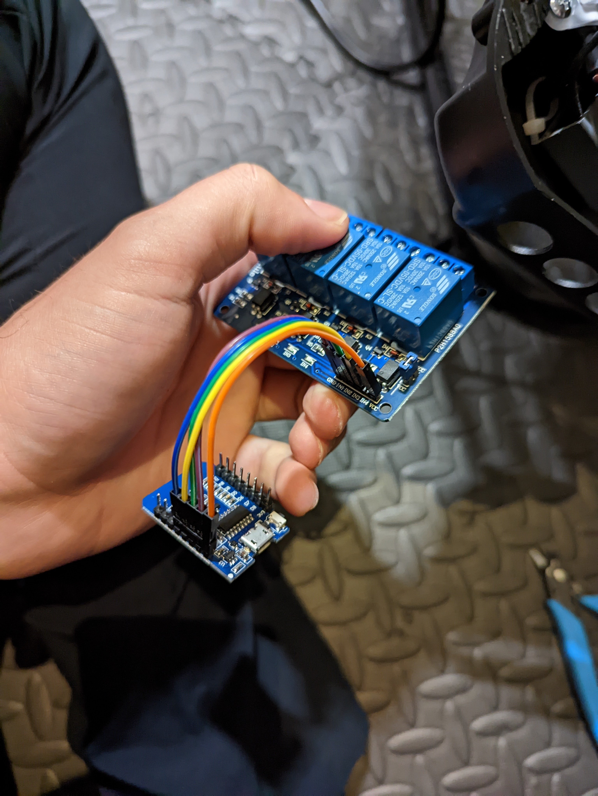

# Zwift Smart Fan

As a triathlete, at some point I had to start the indoor training to train on specific aspect on my physical condition. If you're reading this you may already know that indoor training is strongly synonym to Zwift training, so I started training with this app, and it didn't take me long before realizing that cooling is central to indoor training. I google "Zwift Fans" and after seeing few price tags I closed my browser and decided to find another and cheaper solution. The idea of spending 200€+ in a fan was a nogo, and making my own solution insdead sounded more appealing to me. So here we are, and even though other great article are already out there I decided to share my implementation of DIY Smart Zwift fan with you, and I hope you'll find it useful to make your own as is or to adapt it to your needs.

# Costs

Before we dive into the tutorial, here are the elements I used for this project along their prices.

- Fan with a mechanical switch: 30€
- Relay board: around 3€
- ESP8266: 3€ I choose the WeMos D1 Mini but any ESP will do the job
- Ant+ receiver: 10€ (Optional)

Total: 46€

# Tutorial

## 1. Migrating the mechanical switch to electronically switch

The idea is fairly simple, we have to replace the mechanical switch to control the fan with the ESP. To mimic the push on the buttons we'll be using a 3-channel 5V relay. 

**Unplug** your fan and dismount the switch. You should have something similar to what I have in the following photo. Take a series of photo and even a video of all the connections and cable color before cutting anything.


In my case, the brow cable comes from the wall plug and then 3 cables (blue, white, red) head to the fan motor. So my common cable is the brown one. 

Connect the ESP to the relays and take note of the pin you selected, you'll have to configure in the next step.



Ok you can now cut the wire of your mechanical switch, connect the common cable (brown in my case) to the COM port of 3 relays. Connect the 3 others cables (blue, white, red) to the Normally Open port of each relay, respect the same order as in your mechanical switch. It will be easier to match the relay and the fan speed. Leave the ground cable untouched.


## 2. Install and configure Tasmota to the ESP

Install [Tasmota](https://tasmota.github.io/docs/) on your ESP, this is step is pretty straight forward, and a tons of tutorials are available out there if you don't know how to proceed. There is a [Web install](https://tasmota.github.io/install/) that is super easy to use.


Once Tasmota is installed, find the IP address of your ESP. You'll be presented the dashboard, head the **Configuration** panel and select as Module type `Generic (18)`. 
Configure 3 relays on 3 different GPIO ports. Match the GPIO to the connections you used earlier. Use the `relay_i` options and assign a different value from 1 to 3 on the aside dropdown. 


Save the configuration and let the ESP reboot


On the main page now you should have 3 **Toggle** buttons that appeared, each button controls one relay.


# 3. The software

The Zwift API is not public anymore, making difficult to retrieve data in real time to control the fan. So there are 2 options, using a second Ant+ Stick to retrieve the data from the sensors directly, or using a third party app.

Ok let me show you how to setup the third party app. Login to your Zwift account on the website and head to [Account > Connections](https://www.zwift.com/eu/settings/connections) and scroll down to the end. You should see `Consent to sharing your real time Zwift activities and profile with Zwift GPS and Gold Rush.` 


- click on `Opt-in`. The page should reload and the icon is now colored. 


 
- Next step is about finding your Zwift ID, there are few tutorials out there to find or you can use the official documentation to find it https://support.zwift.com/en_us/locating-your-zwift-id-H1WiyxS_I


Lastly get the code and run the program. You'll find the sources on my github repo at https://github.com/florianpasteur/zwift-smart-fan-controller

Create a JSON configuration file lke so: 

```json
{
  "fanIP": "192.168.1.127",
  "dataProvider": "zwift",
  "observedData": "power",
  "antConfig": {
    "wheelCircumference": 2.120
  },
  "zwiftConfig": {
    "zwiftID": 1231421,
    "pullingInterval": 2500
  },
  "thresholds": {
    "power": {
      "level1": 0,
      "level2": 10,
      "level3": 20
    },
    "speed": {
      "level1": 0,
      "level2": 20,
      "level3": 30
    },
    "hr": {
      "level1": 70,
      "level2": 120,
      "level3": 150
    }
  }
}
```

Replace the 
- `fanIP` by the IP or hostname of the ESP
- `dataProvider` leave `zwift` value. (Use `ant` value if you want to use the second ant+ stick)
- `observedData` choose from `power`, `speed`, `hr` depending on your preference and adjust the corresponding `thresholds`
- `zwiftID`: Your zwift ID 
- `pullingInterval` Adjust the pulling interval (in ms). Keep a high value to not experience a too frequent speed change.

To run the program use the command 

```
> zwift-smart-fan-controller  --config your-config.json
```

# 4. Finish

Put everything back in the case and screw it back to the fan and that's it. You're ready to ride !


